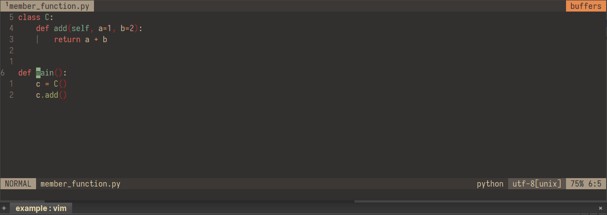

# vim-pyannotate

## Install

```
Plug 'skywind3000/asyncrun.vim'
Plug 'roachsinai/vim-pyannotate'
```

## Usage

1. Cursor on the function (line defines it) that need to be annotated.
2. Run `:AnnotatePyFile`.
3. Follow prompt input only parameters function needed, no brackets surround.

If you want annotate member function, you should custom a function like [example: gcd.py](https://github.com/dropbox/pyannotate/blob/master/example/gcd.py) before do Step 1.

For example,



### Configuration

System python interpreter used by default. If your project using a python virtual environment (for example, named `nn`), you could add

`let g:project_virtual_env = '/home/roach/.pyenv/versions/3.7.4/envs/nn'`

to your vimrc. And make sure you have installed `pyannotate` to `nn` before you use this plugin.

What's more, the value of `g:project_virtual_env` could also be a list of strings: `['/home/roach/.pyenv/versions/3.7.4/envs/nn', '/usr']`. You will be asked to choose python binary of `nn` virtual environment or systerm before input function parameters in this time.

## Project Root

> The project root is the nearest ancestor directory of the current file which contains one of these directories or files: `.svn`, `.git`, `.hg`, `.root` or `.project`. If none of the parent directories contains these root markers, the directory of the current file is used as the project root. The root markers can also be configurated, see [Project Root](https://github.com/skywind3000/asyncrun.vim/wiki/Project-Root).
>
> If your current project is not in any git or subversion repository, just put an empty .root file in your project root.

This plugin vim-pyannotate will create a `.pyannotate` folder under project root.

## Dependences

[dropbox/pyannotate: Auto-generate PEP-484 annotations](https://github.com/dropbox/pyannotate)
